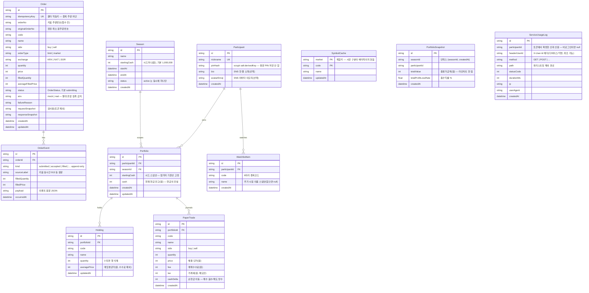

# ERD — 데이터 모델

Prisma 스키마(`apps/api/prisma/schema.prisma`)를 그대로 시각화한 것이다. 스키마가 진실이고
이 문서는 파생물이므로, 스키마가 바뀌면 이 다이어그램도 함께 갱신한다.

## 도메인 경계

DB 는 "키움에 없는 것"만 보관한다. 시세·잔고·예수금의 진실은 키움 서버에 있어 캐시하지 않는다.
두 도메인이 한 DB 안에 공존하지만 **서로 참조하지 않는다**:

- **실계좌 주문**(`Order`, `OrderEvent`) — 키움 주문 API 의 멱등성·상태추적·감사용.
- **모의투자 경쟁**(`Participant`·`Season`·`Portfolio`·`Holding`·`PaperTrade`) — 여기서는 DB 가
  진실이다. 키움 주문 API 를 쓰지 않는다.
- **총평가금액 추이**(`PortfolioSnapshot`) — 리더보드는 즉석 계산이라 이력이 없으므로, 주기적으로
  참가자별 총평가금액을 append-only 로 적재한다(라인차트 시계열). FK 없는 독립 테이블.
- **관심 종목**(`WatchlistItem`) — 참가자별 관심 종목. 코드+이름 스냅샷만 담고 시세는 저장하지 않는다.
- `SymbolCache` — 어느 쪽에도 속하지 않는 종목 마스터 캐시(없어도 동작).
- `ServiceUsageLog` — 전역 인터셉터가 모든 HTTP 요청을 append-only 로 적재하는 사용 이력(감사·분석).
  어느 도메인도 참조하지 않는 독립 테이블이다(FK 없음).



## 핵심 제약 (스키마의 unique / 복합키가 강제하는 규칙)

| 제약 | 대상 | 이유 |
| --- | --- | --- |
| `idempotencyKey` unique | `Order` | 같은 키의 두 번째 요청은 키움으로 나가지 않는다(멱등성). |
| `nickname` unique | `Participant` | 닉네임이 곧 로그인 아이디. |
| `(participantId, seasonId)` unique | `Portfolio` | 한 시즌에 참가자당 포트폴리오 1개. |
| `(portfolioId, code)` unique | `Holding` | 종목당 보유 행 1개(수량 합산). |
| `(participantId, code)` unique | `WatchlistItem` | 참가자당 같은 종목을 한 번만 담는다. |
| `(market, code)` 복합 PK | `SymbolCache` | ka10099 시장 구분이 배타적이지 않아 code 단일키면 서로 덮어씀. |
| `onDelete: Cascade` | 모든 FK | 부모 삭제 시 자식 자동 정리(고아 행 방지). |

## 시각적으로 보는 방법

Mermaid `erDiagram` 이라 **별도 툴 설치 없이** 아래 중 편한 걸로 본다.

1. **GitHub** — 이 `.md` 를 푸시하면 코드블록이 다이어그램으로 자동 렌더링된다(가장 간단).
2. **VS Code** — `Markdown Preview Mermaid Support` 확장 설치 후 `Ctrl/Cmd+Shift+V` 미리보기.
   (이 저장소는 프론트가 VS Code 전제라 팀에 이 방법을 권장)
3. **mermaid.live** — 위 ```mermaid 블록만 복사해 붙이면 즉시 렌더 + PNG/SVG 내보내기.

### 스키마에서 자동 재생성하고 싶다면

수기 동기화가 번거로우면 Prisma 제너레이터로 빌드 시 자동 생성할 수 있다.

```bash
pnpm --filter @stock/api add -D prisma-erd-generator @mermaid-js/mermaid-cli
```

`schema.prisma` 에 추가:

```prisma
generator erd {
  provider = "prisma-erd-generator"
  output   = "../../docs/ERD.svg"   // 또는 .md / .png
}
```

이후 `pnpm --filter @stock/api db:generate` 를 돌리면 `docs/ERD.svg` 가 스키마와 함께 갱신된다.
(단 mermaid-cli 가 Puppeteer/Chromium 을 받으므로 설치 용량이 늘어난다 — 수기 유지가 부담될 때만 도입)
